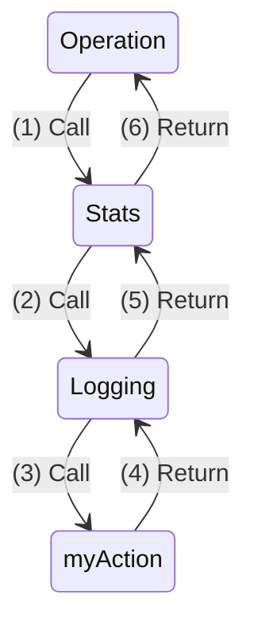

# Decorators

A Decorator is a Middleware implementation called using the same signature as an Action:

```go
action := func(context.Context) error {...}
err := action(ctx)

decoratedAction := MyDecorator(action)
err := decoratedAction(ctx)
```

As described in the previous section, Middleware (such as a Decorator) can perform checks to 
decide whether to pass control to the next Action (possibly another Middleware instance) in the
chain, or return control to its caller.

A Decorator can also inject values into the `Context` to provide later Actions access to calculated
data;  this is the mechanism used by the Authentication filter to inject the User Context into
the current Operation.

Finally, a Decorator can handle, modify or wrap the returned `error` value.  This allows
error values to be logged, mapped from one domain to another, or augmented with extra
information.

## Usage

To apply a Decorator to an Operation, use the `WithDecorator` method to return a new, derived operation:
```go
err := types.NewOperation(myAction).
	WithDecorator(NewLoggingDecorator(logger)).
	Run(ctx)
```

When adding Decorators to Operations, they wrap the inner action as they are applied.
This means that the first applied decorator will be executed right before the Action 
on the way into the Middleware pipeline, and will be executed right after the Action
on the way out of the Middleware pipeline.

For example:

```go
err := types.NewOperation(myAction).
    WithDecorator(NewLoggingDecorator(logger)).
    WithDecorator(NewStatsDecorator(logger)).
    Run(ctx)
```


On execution of the Operation's `Run` method:



1. Operation calls the Stats Decorator `Run` method
2. Stats calls the Logging Decorator `Run` method
3. Logging calls the `myAction` function
4. `myAction` returns to the Logging Decorator
5. Logging returns to the Stats Decorator
6. Stats returns to the Operation

## Implementation

A Decorator wraps an inner `ActionFunc` and returns a new `ActionFunc`.

```go
type ActionFuncDecorator func(action ActionFunc) ActionFunc
```

### Stateless

Static/Stateless decorators (those which do not have runtime-specified dependencies)
can be implemented quite simply, as they do not require a factory:

```go
// Static (stateless) decorator
func Escalate(action ActionFunc) ActionFunc {
    return func(ctx context.Context) error {
        return service.WithSystemContext(ctx, action)		
    }
}
```

### Stateful Closure

Stateful Decorators are often implemented using a closure-based factory, communicating
state via lexical scope:

```go
// Factory for LoggingDecorator, accepting the dependencies,
// and returning a new decorator
func NewLoggingDecorator(logger types.Logger) ActionFuncDecorator {
    // Return the decorator, which can be applied to an Operation
    return func(action ActionFunc) ActionFunc {
        // Return the implementation of the decorator
        return func(ctx context.Context) error {
            // Call the original action
            err := action(ctx)
            // Log the error message
            if err != nil {
                logger.WithContext(ctx).WithError(err).Error("Action failed")
            }
            // Log or handle errors, never both
            return nil
        }       
    }
}
```

### Stateful Struct

A struct-backed Decorator object may look slightly different since it uses an object
to communicate state:

```go
type StatsCounterDecorator struct {
    counterName string
    action ActionFunc
}

func (d StatsCountDecorator) Run(ctx context.Context) error {
    stats.IncrementCounter(d.counterName)
    defer stats.DecrementCounter(d.counterName)
    return d.action(ctx)
}

func NewStatsCountDecorator(counterName string) ActionFuncDecorator {
    return func(action ActionFunc) ActionFunc {
        return StatsCounterDecorator{
            counterName: counterName, 
            action: action,
        }.Run
    }	
}
```

Next, we will look at Filters, which allow Decorators to be applied in a pre-determined order
independent of the Operation instance definition.
