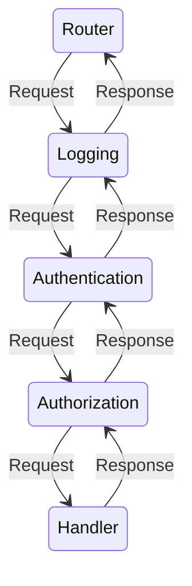

# Middleware

To augment the functionality of Actions, Operations accept a series of Decorators and Filters.
These follow the Middleware (or Mediator) pattern:

> Middleware is software that's assembled into an app pipeline to handle requests and responses. 
> Each component:
> - chooses whether to pass execution to the next component in the pipeline.
> - can perform work before and after the next component in the pipeline.
>
> -- [ASP.NET Core Middleware](https://learn.microsoft.com/en-us/aspnet/core/fundamentals/middleware/?tabs=aspnetcore2x&view=aspnetcore-7.0), Microsoft

For example, when receiving an incoming web request, we use Middleware to pass the incoming request
and outgoing response through a series of stages:

If the Authentication filter detects a request does not carry credentials, it can reject it
immediately and return to the Logging Middleware without executing future stages in the pipeline.

Later, when the Authorization filter detects the logged-in user (determined by the credentials)
does not have permissions to access the requested operation, it can also reject it immediately
and return up the Middleware chain.

Operations support two kinds of Middleware, Decorators and Filters, described in the following sections.
